# IIT Delhi Politics: A Two-Player Strategy Game
## Introduction
In the heart of IIT Delhi, where academia meets ambition, the battleground of college politics unfolds. Take on the role of a student vying for the ultimate honor: the Presidency. Navigate the maze of campus life, from rallying support to facing off in epic duels. Will you rise as a beacon of change or be swallowed by the tide of campus intrigue?

## Theme
The game immerses players in the political landscape of IIT Delhi, combining strategy, campus exploration, and competitive duels.

## Design Decisions
- **Animations**: Added animations everywhere to improve the user experience (UX).
- **Sound Effects**: Incorporated appropriate and interesting sound effects to enhance the gaming experience.
- **Networking**: Used socketing to handle game interactions between players over the shared network.
- **Game Mechanics**: The game design involves strategic thinking and includes a thrilling old-fashioned sword battle face-off against your rival.
- **Development**: Built everything from scratch using Pygame.

## Game Structure
### Two-Player Game
The game is designed for two players to compete against each other.

### Two Rounds
1. **First Round – Campaigning**: Players navigate the campus, completing tasks, and spreading propaganda. The score accumulated in this round determines the resources and abilities available in the next round.
2. **Second Round – Duel**: The finalists face off in a showdown, armed with swords obtained based on their first-round performance. They engage in a duel until one player emerges victorious.

## How to Play
1. **Install Code**: Download the game code from GitHub and install Pygame.
2. **Set Up**: Server intialising and then joining
- To run the server on localhost
```
./scripts/run_server.sh
```
- To run the server on the wifi network
```
./scripts/run_server.sh wifi
```
- This will print the ip address of the server. Now we need to join the game at this ip address.

- Now to join the game Run the following command to join the game mentioning the ip address of the server and the alias of the player.
```
./scripts/run_game.sh ip_address alias_of_the_player
```
3. **Round 1**: Start playing Round 1, interact with entities, and complete tasks to build your candidature profile for the presidential elections.
4. **Wait**: After round 1 ends, wait for the other player to complete round 1.
5. **Final Showdown**: Play a final showdown with the other player to win the elections.
6. **Victory**: The last standing player wins!

## Round 1: Campaigning
Navigate IIT Delhi campus to complete campaigning tasks!
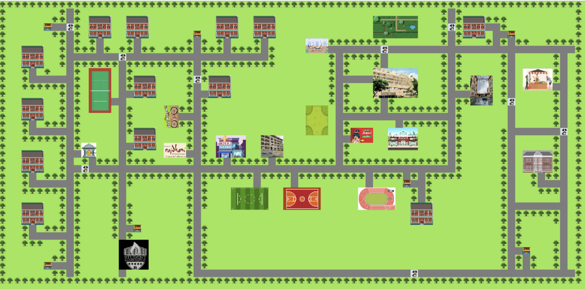
### Player Profile
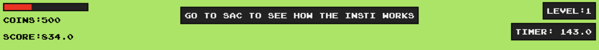
- **Health**
- **Coins**
- **Score**
- **Instructions**
- **Timer**

1. Player moves to the next round if health goes to zero.
2. Round one ends if either player completes all tasks or the timer reaches zero.
3. Score is calculated using health, time left, and coins collected.

#### Health Recharge
- **Hospital (Press h)**: Recharges health to full at the cost of 40 points.


- **Outlets (Press f)**: Increases health by 20 at the cost of 10 points.


#### Dogs and Coins
- **Dogs**: NPCs that reduce player health by 5 units upon collision.
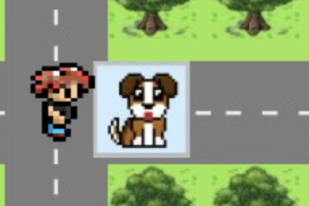

- **Coins**: Each coin is worth 50 points.


#### Yulu Riding
- **Press y**: Get on Yulu.
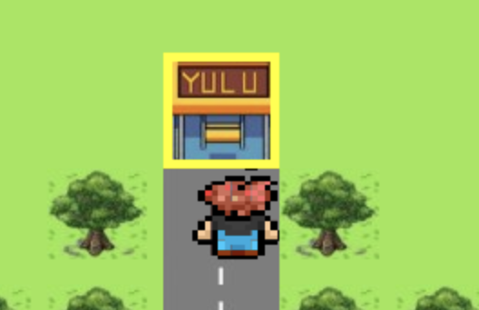

- **Bill**: Accumulates over time.
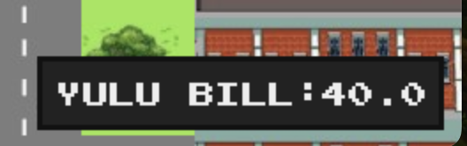

- **Press t**: Get off Yulu.
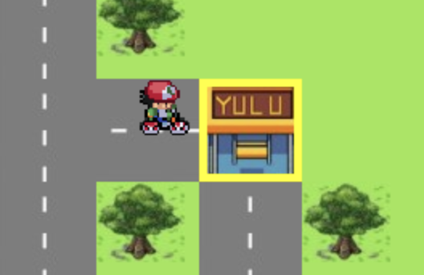

### Tasks


- **Fixed Time**: The round runs for a fixed time in which the player must complete as many tasks as possible.
- **Task Completion**: Each completed task earns points. After completing all tasks, the player moves to round two.
- **Score Calculation**: The sooner the player finishes all tasks, the higher the final score.

### Player Speed
- **Road**: Speed = 6, energy decreases at the fastest rate. 
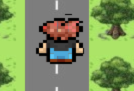

- **Grass**: Speed = 2, energy decreases at a rate slower than the road.
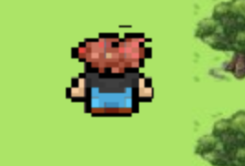

- **Yulu**: Speed = 4, energy decreases at a fixed rate.
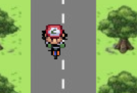

### Round 1 Results
The game keeps pinging the server to check the status of the second player.
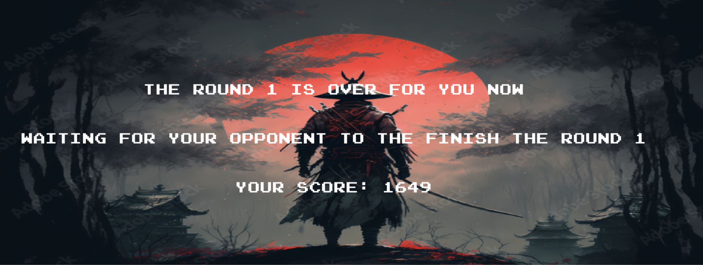

## Round 2: Duel
- A duel between you and your competitor begins as soon as both players complete round one.
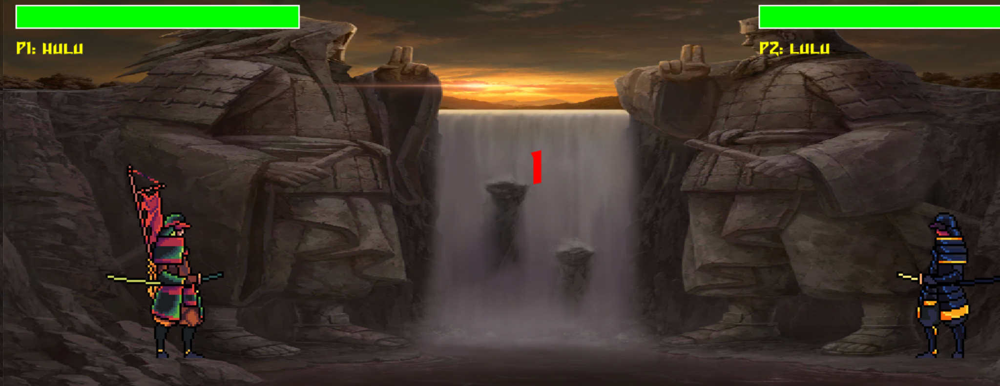

- **Better Sword**: Higher scores in round one result in better swords for the duel.

### Client-Server Architecture
- **Server**: Stores the profile data of both players.
- **Data Handling**: Overwrites the received profile data and sends the profile data of the opposite player. Prevents race conditions by ensuring one thread only reads and the other thread only writes to the location.
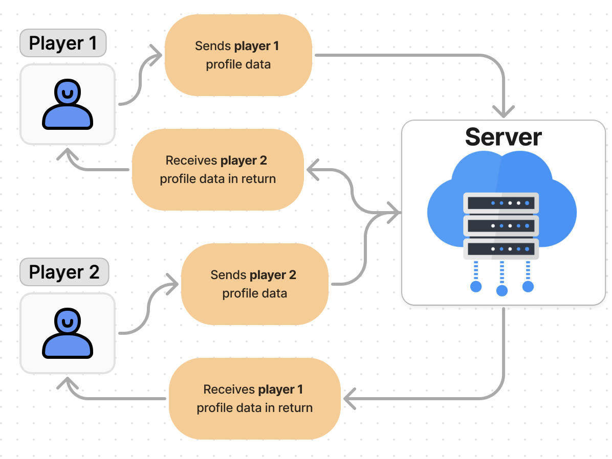

### Controls
- **Attack 1 (Key C)**: Light Attack (Lower cooldown).
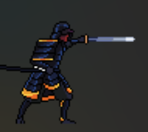

- **Attack 2 (Key Z)**: Heavy Attack (Higher cooldown).
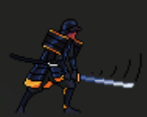

- **Defense (Key X)**: Block (Has cooldown, so you can’t block permanently).
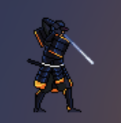

Use arrow keys for the controls **Jump**, **Run Right** , **Run Left**

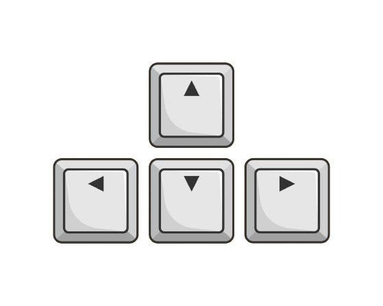

## Round 2 Results
- The final results of the duel determine the winner.
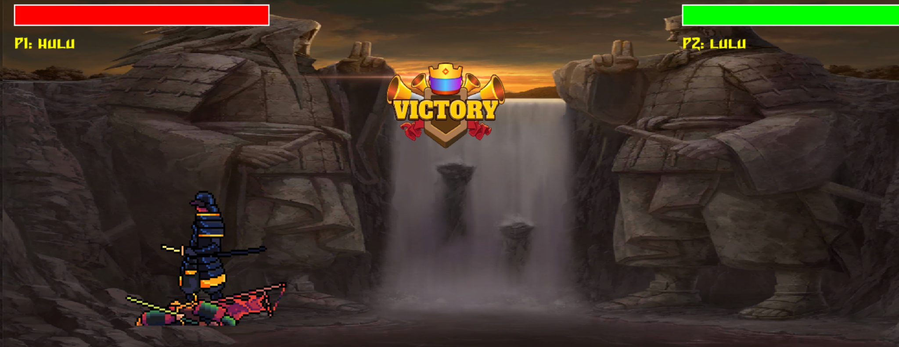